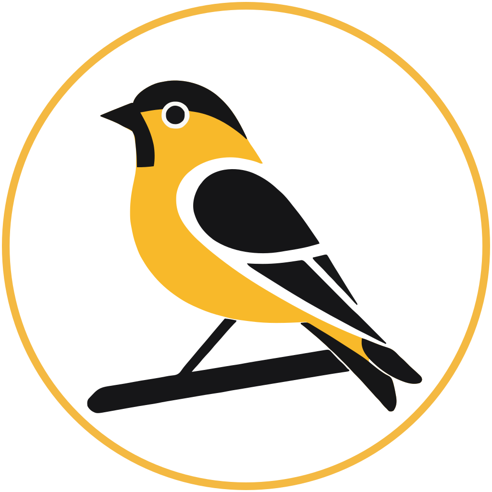

# Goal Finch

A simple, flexible progress tracker for personal goals.

Features:
* Low-key visual reminders to help you stay on track.
* Simple setup, with a ton of flexibility.
* You can track virtually anything.
* Complete control of personal data
* Open source and extensible

## Links

* [www.goalfinch.com](https://www.goalfinch.com): The app is hosted here
* [docs.goalfinch.com](https://docs.goalfinch.com): Technical documentation
* [https://github.com/abegong/goalfinch](https://github.com/abegong/goalfinch): Github repo

## Code manifest

This is a monorepo, containing several different parts of the application and its supporting documentation.

* `ui/` : Source code for the front-end app (React)
* `server/` : Source code for the API server (node.js and Typescript)
* `python/scripts/` : Scripts to connect to the server (python)
* `python/docs/` : Technical documentation (mkdocs-material)

Everything in here is unfinished and WIP.