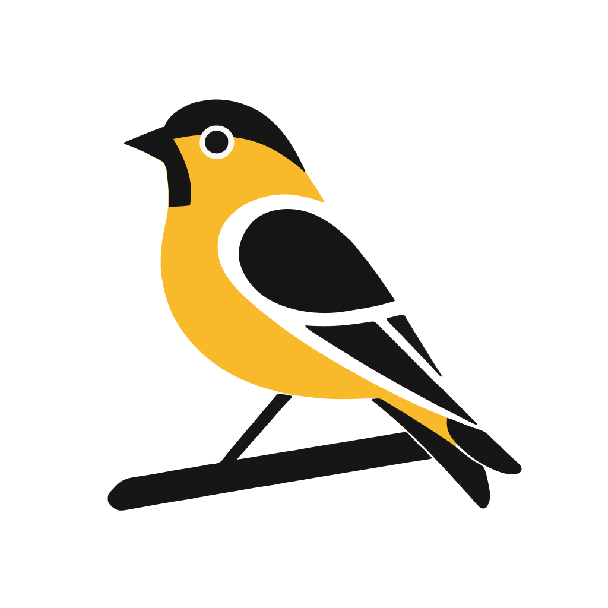

This site contains technical documentation for [Goal Finch](https://www.goalfinch.com). If you're looking to extend, integrate, or contribute to the project, this is a great place to start!

* For the app itself, please visit [www.goalfinch.com](https://www.goalfinch.com).
* If you're looking for the source code, go to [https://github.com/abegong/goalfinch](https://github.com/abegong/goalfinch).

## Sections

Each section of the documentation is focused on a different purpose. If you're new, please take a moment to understand what each section is for.

* **Tutorials**: Focused how-to guides explaining **how** to set up and extend the system.
* **Architecture**: Written in the spirit of [technical design docs](https://uit.stanford.edu/pmo/technical-design), this section focuses on **why** key parts of the system are built the way they are.
<!-- * **API reference**: Explains **what** API calls are available and what to expect when calling them. -->
<!-- * **Contributing**: Guides for **who** can contribute to the project and the steps to do so. -->

